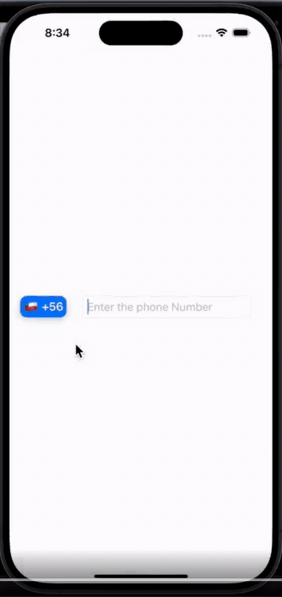

# CountryCallingCode

A lightweight Swift Package providing detailed country data with full bilingual support (Arabic + English) — built for SwiftUI and UIKit projects.

[](https://swift.org)
[](https://www.apple.com)
[](https://swift.org/package-manager)
[](LICENSE)

> Access country names, codes, calling codes, and emoji flags — and search by any attribute — with a clean, offline-first Swift API designed for apps that need first-class Arabic and right-to-left language support.

---

## Demo

<!-- Convert your LinkedIn demo video to GIF, save it as docs/demo.gif, then uncomment the line below: -->


---

## Why this package

Most country-data Swift packages are English-only, require network calls, or bundle data inefficiently. **CountryCallingCode** ships all country data locally with **bilingual support (Arabic + English)** and a clean search API — designed specifically for apps targeting MENA markets or any product that needs first-class right-to-left language support.

---

## Features

- 🌍 **Bilingual country data** — names available in both Arabic and English
- 📞 **Complete country info** — name, ISO country code, international calling code, and emoji flag
- 🔍 **Flexible search** — find countries by name (Arabic or English), country code, calling code, or flag
- 📦 **Zero dependencies** — pure Swift, no third-party libraries
- ✈️ **Offline-first** — all data bundled in the package; no network calls
- 🧩 **SwiftUI and UIKit compatible**

---

## Requirements

- Swift **6.0+**
- Xcode **16.0+**
- iOS 13.0+ recommended

---

## Installation

### Swift Package Manager (Xcode)

1. In Xcode, go to **File → Add Packages…**
2. Paste the repository URL:

   ```
   https://github.com/Mohamed-Mostafa7/CountryCallingCode
   ```

3. Choose the version (recommended: **Up to Next Major Version**)
4. Click **Add Package**

### Swift Package Manager (Package.swift)

Add CountryCallingCode as a dependency in your `Package.swift`:

```swift
dependencies: [
    .package(url: "https://github.com/Mohamed-Mostafa7/CountryCallingCode.git", from: "1.0.0")
]
```

Then add `"CountryCallingCode"` to your target's dependencies array.

---

## Usage

### Initialize the provider

```swift
import CountryCallingCode

let provider = CountriesProvider()
```

### Get all countries

```swift
let allCountries = provider.countries
```

### Search by name (Arabic or English)

```swift
// English
if let results = provider.fetch(name: "Egypt") {
    // Returns countries matching "Egypt"
}

// Arabic — returns the same results
if let results = provider.fetch(name: "مصر") {
    // Returns Egypt country data
}
```

### Search by ISO country code

```swift
if let results = provider.fetch(code: "EG") {
    // Returns countries matching the code "EG"
}
```

### Search by calling code

```swift
if let results = provider.fetch(callingCode: "+1") {
    // Returns countries whose calling code contains "+1"
}
```

### Search by flag

```swift
if let results = provider.fetch(flag: "🇺🇸") {
    // Returns countries matching the flag
}
```

---

## SwiftUI example

A complete SwiftUI search view using the package:

```swift
import SwiftUI
import CountryCallingCode

struct CountrySearchView: View {
    @State private var searchQuery = ""
    @State private var searchResults: [Country] = []

    private let provider = CountriesProvider()

    var body: some View {
        NavigationView {
            VStack {
                TextField("Search for a country", text: $searchQuery, onCommit: searchCountries)
                    .textFieldStyle(.roundedBorder)
                    .padding()

                List(searchResults, id: \.code) { country in
                    VStack(alignment: .leading, spacing: 4) {
                        HStack {
                            Text(country.flag)
                            Text(country.name.english)
                                .font(.headline)
                        }
                        Text(country.name.arabic)
                            .font(.subheadline)
                            .foregroundColor(.secondary)
                        Text("Code: \(country.code)  ·  Calling: \(country.callingCode)")
                            .font(.caption)
                    }
                }
            }
            .navigationTitle("Country Search")
            .onAppear {
                searchResults = provider.countries ?? []
            }
        }
    }

    private func searchCountries() {
        searchResults = []
        if let results = provider.fetch(name: searchQuery) {
            searchResults.append(contentsOf: results)
        }
    }
}
```

---

## Contributing

Contributions are welcome. Open issues for bugs or feature requests, or submit a pull request:

1. Fork the repository
2. Create a feature branch (`git checkout -b feature/your-feature`)
3. Commit your changes
4. Push and open a Pull Request

---

## License

MIT License. See [LICENSE](LICENSE) for details.

---

## Author

**Mohamed Mostafa Darwish**
iOS Developer · Egypt

📧 [mohameds.mostafas7@gmail.com](mailto:mohameds.mostafas7@gmail.com)
💼 [LinkedIn](https://linkedin.com/in/mohamed-mostafa-917390192)
